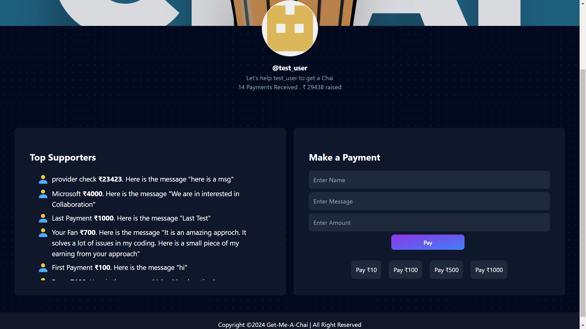

# Get Me A Chai

[https://fund-me-chai.vercel.app](get-me-a-chai)

## Project Description
Get Me A Chai is a crowdfunding platform created using Next.js (app route), React, MongoDB, and Node.js. It is designed for developers who need funds to complete their projects. Fans and supporters of developers or project creators can support them by sending funds. Developers need a Razorpay account to receive funds and must generate a client ID and secret. 

On the dashboard, developers or project creators can provide the project name, description, and link, allowing potential fund givers to learn about the project and decide whether to contribute. The refund policy is entirely at the discretion of the project developers.
## Tech Stack
1. NextJS with TailwindCSS
2. MongoDB
## Features

- **Easy to Use**: The platform offers a user-friendly interface that allows developers and supporters to navigate and use the site with ease.
- **Payment Gateway Integrated**: Integration with Razorpay ensures secure and smooth transactions, allowing supporters to fund projects with confidence.
- **Free to Use**: There are no fees for using the platform. Both developers seeking funds and supporters looking to contribute can use the platform without any cost.
- **Security**: The platform employs robust security measures to protect user data and transactions, ensuring a safe environment for both developers and fund givers.
- **Raise Funds for Multiple Projects**: Developers can create and manage multiple fundraising campaigns simultaneously, providing flexibility to fund various projects at the same time.
## Screenshots





## Environment Variables

To run this project, you will need to add the following environment variables to your .env.local file
```
NEXT_PUBLIC_URL=http://localhost:3000
MONGODB_URI="mongodb://localhost:27017/get-me-a-chai"
NEXTAUTH_URL=http://localhost:3000
NEXTAUTH_SECRET=<a secret>
GITHUB_ID=<your github id>
GITHUB_SECRET=<your github secret>
GOOGLE_ID=<your google id>
GOOGLE_SECRET=<your google secret>
```
## Installation
To install this project into your local machine run this command

Clone the repository:
   ```bash
   git clone https://github.com/Advanced-Boy-Shreyash/Get-Me-A-Chai.git
```
## Run Locally
- Go into the folder you have installed this project and proceed with following procedure

1. Install dependencies

```bash
  npm install
```

2. Create a Razorpay account and obtain your Razorpay ID and secret for testing.

3. Create a .env.local file in the root directory (as motioned above).

4. Run the development server:
```bash
  npm run dev
```

5. Open your browser and navigate to http://localhost:3000.
## Usage/Examples

#### For Project Creators or Developers:
1. Users will sign up through Google or GitHub (credential login is not supported, users use NextAuth).
2. Users will be redirected to their dashboard where they need to fill in the project name, description, link, Razorpay ID, and secret.
3. Click the save button. If the payment details are correct, they will start receiving funds into their Razorpay account if fund givers contribute.
4. On the dashboard, developers can edit their information except for their email ID.

#### For Fund Givers:
1. On the homepage, click the 'Fund Raisers' button.
2. A list of the top 10 fund raisers who received the highest funds for their projects will be displayed.
3. Use the search field to find project developers by their project, username, or developer name.
4. Once you find a project you wish to support, click on it to view the project details, including the project name, description, and a link to the project.
5. If you decide to contribute, click on the 'Pay' button by filling required data and you will be redirected to a secure payment page powered by Razorpay.
6. After the transaction is successful, you will receive a confirmation of your contribution, and the funds will be directly transferred to the developer's Razorpay account.

Thank you for your interest in Get Me A Chai! We hope this platform helps you successfully fund your projects and support developers in bringing their ideas to life.